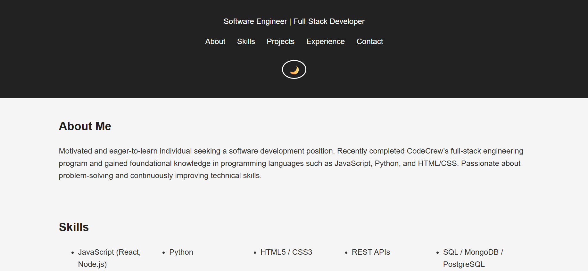

# Kadarius Clemons — Software Engineer Portfolio

Welcome to my personal portfolio website!  
This site showcases my skills, projects, and experience as a **Full-Stack Software Engineer**.  

Live Site: [View Portfolio](https://kadarius-portfolio.netlify.app/)
Resume: [Download / View Resume](https://kadariusclemons.github.io/portfolio/assets/Resume.pdf)  

---

## About Me
I am a motivated and eager-to-learn developer who recently completed CodeCrew's Full-Stack Bootcamp in Memphis.  
I’m passionate about solving real-world problems with clean, efficient code and building modern web applications.  

---

## Skills
- **Languages:** JavaScript (Node.js, React), Python, HTML5, CSS3, SQL  
- **Frameworks:** Express, Flask, Bootstrap, React  
- **Databases:** MongoDB, MySQL, PostgreSQL  
- **Tools:** Git, GitHub, Heroku, Netlify, AWS (basic)  
- **Development Practices:** Agile, Responsive Design, REST APIs, Unit Testing  

---

## Projects

### [Portfolio Website](https://kadarius-portfolio.netlify.app/)
A responsive personal website to showcase my work, resume, and contact info.  
**Tech Used:** HTML, CSS, JavaScript, GitHub Pages  

---

### [Weather App](https://kadarius-weather.netlify.app/)
Fetches real-time weather data from the OpenWeatherMap API.  
**Tech Used:** JavaScript, APIs, HTML, CSS  

---

### [Task Management App](https://kadarius-todo.netlify.app/)
A full-stack task management application with CRUD operations.  
**Tech Used:** Node.js, Express, RESTful APIs, JWT Auth  

---

## Contact Me
- **Email:** [clemonskadarius@gmail.com](mailto:clemonskadarius@gmail.com)  
- **Phone:** (213) 610-9803
- **GitHub:** [github.com/kadariusclemons](https://github.com/kadariusclemons)  
- **LinkedIn:** [linkedin.com/in/kadariusclemons](https://linkedin.com/in/kadariusclemons)  

---

## Screenshot

---

## Deployment
- Hosted on **Netlify** → [Portfolio Live Link](https://kadarius-portfolio.netlify.app/)

---

Built with passion by **Kadarius Clemons** — Software Engineer & Problem Solver
